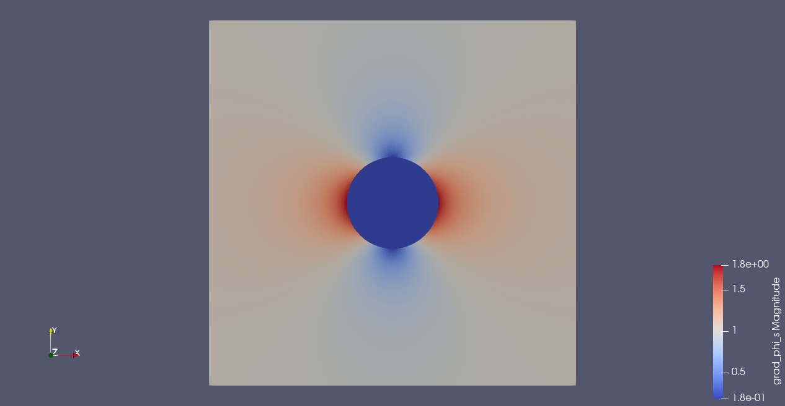
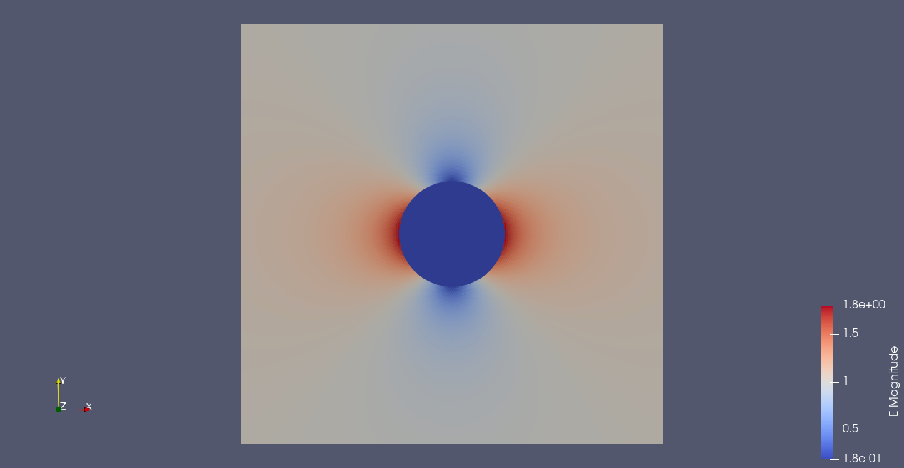

# electromagnetic_FEM
Experiments with various FEM techniques in electromagnetism, starting with electrostatics (note analogy with diffusion problems).

# Electrostatics

The problem is $\nabla \cdot D = 0$, $E=-\nabla \phi$ for a continuous scalar potential function $\phi$.  $D= \epsilon E$.

$D_{\perp}$ and $E_{\parallel}$ are continuous at material boundaries.  

For a primal formulation of the problem of a 2D circular dielectric in a uniform applied electric field see electrostatic_primal.py.  This solves directly for the electric potential $\phi$ - it works fine because $\phi$ is a fully-continuous scalar function and this is compatible with the choice of straightforward CG elements.  Note that the dielectric function lives in a discontinuous Galerkin space (so it can be discontinuous at material boundaries).  Note that it is often possible to sidestep difficulties encountered with vectorial problems by solving instead for a scalar potential (presumably this is not possible for more general elecromagnetic problems though).

For a more advanced FEEC formulation of the same problem, see electrostatic_FEEC.py.  This uses a choice of elements such that $\sigma=\nabla \cdot D$ is fully continuous (in fact it vanishes identically) and $u=E=-\grad \phi$ is continuous only in the component parallel to the element edges (this is clearly good since material boundaries lie along element edges in a conforming discretization, as here).  Note the problems start to appear if the spaces chosen are not compatible with the (dis)continuity requirements of the vector fields i.e. $E_{\parallel}$ and $D_{\perp}$ are required to be continous at dielectric boundaries, but the other components are discontinuous.

